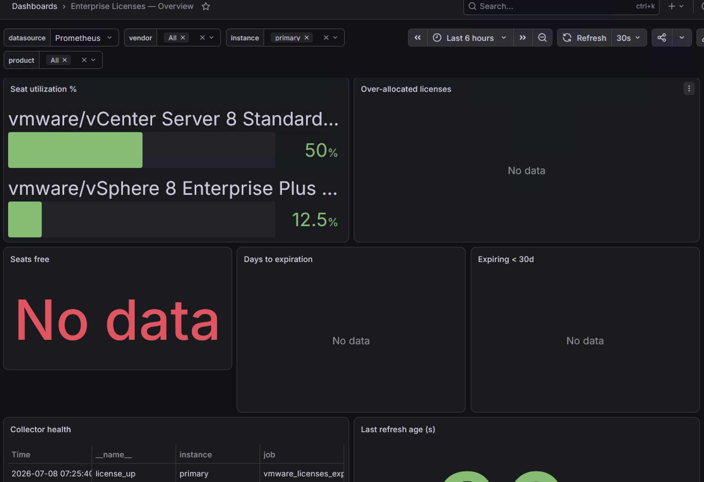

# Dashboards

The demo stack auto-provisions one Grafana dashboard,
`grafana/dashboards/licenses-overview.json` (uid `licenses-overview`, tagged `licenses`,
`vmware_licenses_exporter`), via `grafana/provisioning/dashboards/dashboards.yml` (file
provider) and `grafana/provisioning/datasources/datasource.yml` (Prometheus datasource).
Bring it up with `docker compose up` (see [Docker deployment](deployment/docker.md)) and
open Grafana at `http://localhost:3000`.

## Template variables

| Variable | Query | Purpose |
|---|---|---|
| `datasource` | Prometheus datasource picker | Selects which Prometheus to query. |
| `vendor` | `label_values(license_up, vendor)` | Vendor label (this exporter emits only `vmware`; the variable keeps the dashboard shareable across the `license_` family). |
| `instance` | `label_values(license_up{vendor=~"$vendor"}, instance)` | Filter to specific vCenters. |
| `product` | `label_values(license_seats_total{vendor=~"$vendor"}, product)` | Filter to specific license keys (e.g. `vSphere 8 Enterprise Plus`). |

## Panels

| # | Panel | Type | Query |
|---|---|---|---|
| 1 | Seat utilization % | bar gauge | `100 * license_seats_used / license_seats_total` |
| 2 | Over-allocated licenses | table | `license_seats_used > license_seats_total` |
| 3 | Seats free | stat | `license_seats_total - license_seats_used` |
| 4 | Days to expiration | table (sorted ascending) | `(license_expiration_timestamp_seconds - time()) / 86400` |
| 5 | Expiring < 30d | table | `license_expiration_timestamp_seconds - time() < 30*86400` |
| 6 | Collector health | table | `license_up{vendor=~"$vendor",instance=~"$instance"}` |
| 7 | Last refresh age (s) | stat | `time() - license_collector_last_success_timestamp_seconds` |

Because unlimited license keys (`Total <= 0`) never emit `license_seats_total`, and perpetual
keys never emit `license_expiration_timestamp_seconds` (see
[docs/metrics.md](metrics.md)), they simply do not appear as rows in the "Seat utilization"
or "Days to expiration" panels — there is no sentinel value to filter out.

## Alert rules

`deploy/prometheus/license.rules.yml` (loaded by the demo Prometheus) mirrors the dashboard's
raw-facts panels as alerts:

| Alert | Expression | `for` | Severity |
|---|---|---|---|
| `LicenseOverAllocated` | `license_seats_used > license_seats_total` | 15m | warning |
| `LicenseExpiringSoon` | `license_expiration_timestamp_seconds - time() < 30 * 86400` | 1h | warning |
| `LicenseCollectorDown` | `license_up == 0` | 30m | critical |

## Importing elsewhere

Outside the demo stack, import `grafana/dashboards/licenses-overview.json` directly:
**Dashboards → New → Import**, upload the JSON, and select your own Prometheus data source.
No further edits are required — the dashboard's queries only reference the generic
`license_*` metric family, so it works unmodified against any exporter instance in the
family regardless of which vendors are enabled.
